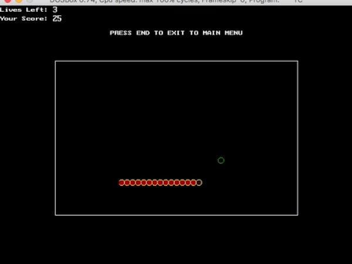

# Snake-Game

### Overview
A Snake Game Program in C++ using graphics library.

Please don't judge as it was a originally a project for my 12th grade examinations in school :D, also it was my first computer program.

 

 

### Genetic Algorithm Implementation
I made a regular version in 12th grade with keyboard controls and wrote the scores with timestamp in a file specific to each user and displayed them chronologically with an option to search through them.

Last year, after watching a youtube video on Genetic Algorithms where a guy trains the Chrome Dinosaur to play by itself, I got pretty inspired and started studying about it. I wanted to apply it to my snake game, so I searched my old computer and found the program.

I wrote the logic for neurons using sigmoid function and various other functions.

The input layer consisted of the manhattan distance to the food's position and positions of every point on the snake's body. The output layer consisted of the potential directions in which the snake can move.

I was generating the set of ten genomes randomly in the beginning and after that kept writing the generated genomes and their respective scores in a file.

 

### Results of Genetic Algorithm Implementation
At first the snake was mostly eating itself and getting killed, but after some generations it actually learnt not to kill itself and all the succeeding generations did not kill themselves even once.

That said, I saw no progress towards eating the food efficiently.

I learnt that this was maybe a wrong place to apply Genetic Algorithm and graph search would easily solve the problem. But Genetic Algorithm was completely new to me and my passion for algorithm designing compelled me to somehow apply it :).

Well, even though it was quite a naive approach I learnt a lot during the course of this project.

Also my respect for OOPS concepts and IDEs multiplied many folds after working on my own project which was a single file containing 3000+ lines, contained only functions, had incomprehensible variable names and method names and which used graphics library which can only be run on Turbo C++ IDE without getting into much hassles.